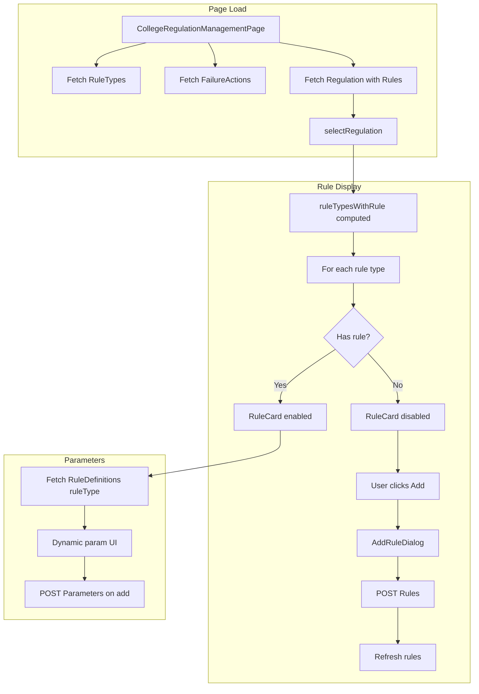

# Pass/Fail Regulation Rule Types Refactor

## Current State

- [CollegeRegulationManagementPage.vue](c:\Development\Work\LMS\SIS-front\src\projects\sis\pages\passFailRegulation\CollegeRegulationManagementPage.vue) uses hardcoded `RULE_CONFIGS` (5 fixed rule types) and `ruleByType()` to ensure all configs have a rule
- [RuleCard.vue](c:\Development\Work\LMS\SIS-front\src\projects\sis\pages\passFailRegulation\components\RuleCard.vue) has hardcoded parameter UIs per `ruleType` (1–5)
- Rules are normalized from regulation response; `selectRegulation` merges incoming rules with `RULE_CONFIGS` so all 5 always exist

## Target State

- **Rule types**: Fetched from `GET /sis_api/api/PassFail/RuleTypes` (8 types: MinCourseGrade, MinCategoryTotal, etc.)
- **Display**: All rule types shown; only those with a rule in `regulation.rules` are enabled/editable
- **Add rule**: When user activates an inactive rule type, open dialog → POST `Rules` → rule created with server id
- **Parameters**: Driven by `GET /sis_api/api/PassFail/RuleDefinitions/{ruleType}` (dataType, validation, scope flags)
- **Failure actions**: From `GET /sis_api/api/PassFail/FailureActions` for add-rule dialog
- **Rule title**: Use Rule Type `labelAr` (or `label`/`labelEn` based on locale)

---

## Architecture




---

## Implementation Plan

### 1. Store: New API Actions

**File:** [passFailRegulationStore.js](c:\Development\Work\LMS\SIS-front\src\projects\sis\stores\passFailRegulationStore.js)

Add:

- `getRuleTypes()` → `apiGet("/sis_api/api/PassFail/RuleTypes")` → return `response.data` (array)
- `getFailureActions()` → `apiGet("/sis_api/api/PassFail/FailureActions")` → return array
- `getRuleDefinitions(ruleTypeId)` → `apiGet(\`/sis_api/api/PassFail/RuleDefinitions/${ruleTypeId})` → return array

`createRule` and `createParameter` already exist; ensure payloads match API:

- **Rules**: `passFailRegulationId`, `ruleType`, `sortOrder`, `isActive`, `failureAction`, `failureMessage`, `title`
- **Parameters**: `passFailRuleId`, `parameterKey`, `parameterValue`, `courseCategoryId`, `courseId`, `lookupCourseDegreeDevisionId`, `gradeScaleId`

---

### 2. CollegeRegulationManagementPage: Data & Logic

**File:** [CollegeRegulationManagementPage.vue](c:\Development\Work\LMS\SIS-front\src\projects\sis\pages\passFailRegulation\CollegeRegulationManagementPage.vue)

**Remove:**

- `RULE_CONFIGS` constant
- `localizeConfig`
- `ruleByType` (no longer create blank rules for missing types)
- `blankRule`
- Logic that ensures all 5 types exist in `rules.value`

**Add:**

- `ruleTypes` ref (from `getRuleTypes()`)
- `failureActions` ref (from `getFailureActions()`)
- `ruleTypesWithRule` computed: for each `ruleTypes` item, attach `rule: ruleByType(value)` or `rule: null` if not in regulation
- `ruleByType(type)` simplified: only returns existing rule from `rules.value` (no creation)
- `selectRegulation`: set `rules.value = mapped` from `data.rules` only (no merge with configs)
- `createNewRegulation`: set `rules.value = []`
- `addRuleDialogVisible`, `addRuleDialogRuleType` refs for Add Rule flow

**Template change:**

```vue
<RuleCard
    v-for="rt in ruleTypesWithRule"
    :key="rt.value"
    :tx="tx"
    :rule-type="rt"
    :rule="rt.rule"
    :failure-actions="failureActions"
    :courses="courses"
    :categories="courseCategories"
    :divisions="degreeDivisions"
    :grade-scales="gradeScales"
    @add-rule="openAddRuleDialog"
    @rule-added="onRuleAdded"
/>
```

**Load flow:** In `loadPage` / `selectRegulation`, fetch `ruleTypes` and `failureActions` (can be once on mount; regulation rules on each select).

---

### 3. AddRuleDialog Component (New)

**File:** `src/projects/sis/pages/passFailRegulation/components/AddRuleDialog.vue`

- Props: `visible` (v-model), `ruleType` (from RuleTypes API), `regulationId`, `failureActions`, `nextSortOrder`
- Form: failure action (Select), failure message (InputText/Textarea), title (pre-filled from `ruleType.labelAr`, editable)
- On confirm: `store.createRule({ passFailRegulationId, ruleType: ruleType.value, sortOrder, isActive: true, failureAction, failureMessage, title })` → emit `rule-added` with created rule
- Use Volt `Dialog`, `Select`, `InputText`/`Textarea`, `Button`

---

### 4. RuleCard: Disabled vs Enabled, Dynamic Params

**File:** [RuleCard.vue](c:\Development\Work\LMS\SIS-front\src\projects\sis\pages\passFailRegulation\components\RuleCard.vue)

**Props:**

- `ruleType` (object: `{ value, name, labelAr, labelEn }`)
- `rule` (object or null; null = disabled)
- `failureActions`, `courses`, `categories`, `divisions`, `gradeScales`
- Emit: `add-rule`, `rule-added`

**Display logic:**

- If `rule === null`: show disabled card (opacity, no toggle), title from `ruleType.labelAr`, "Add" button → emit `add-rule`
- If `rule`: show enabled card with toggle, expandable params section

**Parameter UI (replace hardcoded ruleType 1–5):**

- On expand: fetch `store.getRuleDefinitions(ruleType.value)` (or receive as prop if parent caches)
- For each definition: render input by `dataType`:
  - `decimal` / `integer` → `InputNumber` with `validationMin`, `validationMax`
  - `string` → `InputText`
  - `options` present → `Select` from options
- Scope selectors (when `allowCourseScope`, `allowCourseCategoryScope`, etc.): show `Select` for course, category, division, gradeScale based on definition flags
- `parameterMode`: 1 = single value; 3 = multiple rows (allow adding multiple parameter rows per key)
- "Add parameter" creates new row; on save/add, `store.createParameter(...)` with `passFailRuleId`, `parameterKey`, `parameterValue`, scope ids

**Pill / failure action display:** Use `rule.failureActionName` or lookup from `failureActions` when `rule` exists. For disabled, show neutral pill.

---

### 5. Lookups for Scopes

**Current:** `courses`, `courseCategories`, `degreeDivisions`, `gradeScales` are refs but `loadLookups` has API calls commented out.

**Action:** Uncomment or wire real APIs in `passFailRegulationStore.getLookups()` (or equivalent) so these are populated for parameter scope dropdowns. Use existing stores (e.g. `courseCategoryStore`, `gradeScaleStore`) if available, or add to `passFailRegulationStore`.

---

### 6. Save Flow Adjustments

**File:** [CollegeRegulationManagementPage.vue](c:\Development\Work\LMS\SIS-front\src\projects\sis\pages\passFailRegulation\CollegeRegulationManagementPage.vue)

- `saveAll`: iterate only over `rules.value` (rules that exist). No creation of blank rules.
- New rules are created via AddRuleDialog (immediate POST).
- New parameters: either (a) immediate POST when user adds in RuleCard, or (b) batch in `saveAll`. Recommend (a) for consistency with "add rule → add params" flow.
- If (a): RuleCard calls `store.createParameter` on add, then appends to `rule.parameters` with server id from response.
- `simulate` payload: use `rules.value` as-is (only existing rules).

---

### 7. Normalize Rule from API

Ensure `normalizeRule` handles the regulation response shape:

- `ruleTypeName`, `failureActionName` (for display)
- `parameters` with `parameterKey`, `parameterValue`, `courseCategoryId`, `courseId`, `lookupCourseDegreeDevisionId`, `gradeScaleId`, `parameterMode`, `displaySummary`

---

### 8. Translations

**File:** [passFailRegulationTranslations.js](c:\Development\Work\LMS\SIS-front\src\projects\sis\translations\passFailRegulationTranslations.js)

Add keys for:

- `addRule`, `addRuleTitle`, `addRuleSubtitle`
- `selectFailureAction`, `failureMessage`
- `ruleTypeDisabled`, `clickToAddRule`

---

## File Summary


| File                                  | Action                                                                                          |
| ------------------------------------- | ----------------------------------------------------------------------------------------------- |
| `passFailRegulationStore.js`          | Add `getRuleTypes`, `getFailureActions`, `getRuleDefinitions`; ensure create payloads match API |
| `CollegeRegulationManagementPage.vue` | Replace RULE_CONFIGS with ruleTypes, ruleTypesWithRule, AddRuleDialog, update template          |
| `RuleCard.vue`                        | Support disabled state, dynamic params from RuleDefinitions, emit add-rule                      |
| `AddRuleDialog.vue`                   | New component for adding a rule                                                                 |
| `passFailRegulationTranslations.js`   | Add new translation keys                                                                        |


---

## Open Questions

1. **Parameter save timing**: Should each new parameter POST immediately when the user adds it, or batch with the main Save button? Recommendation: immediate POST for consistency with add-rule flow.
2. **Delete rule**: Is there a DELETE endpoint for rules, and should users be able to remove a rule? (Not specified; can add later.)
3. **Lookups**: Confirm which APIs populate `courses`, `courseCategories`, `degreeDivisions`, `gradeScales` (e.g. `/sis_api/Course`, `/sis_api/CourseCategory`, etc.) so they can be wired in `getLookups`.

